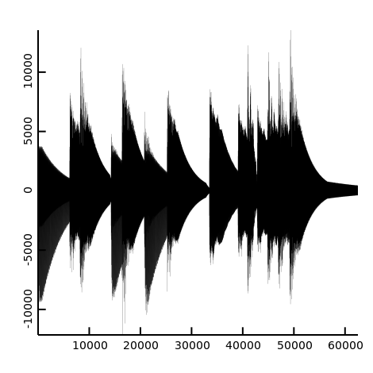
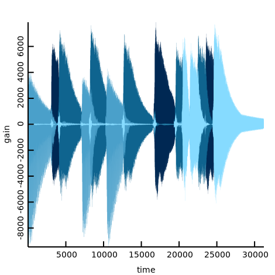
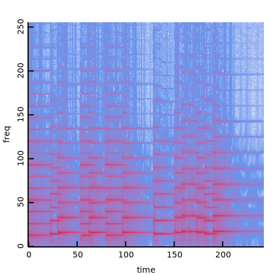
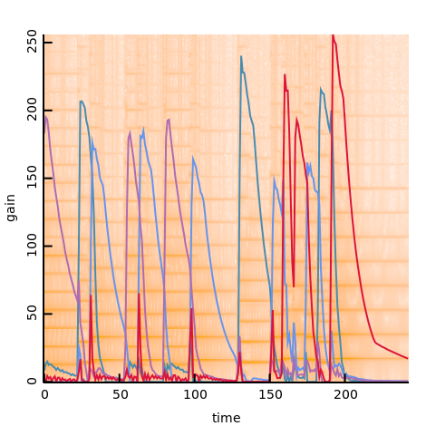

# Audio separation using STFT and non-negative matrix factorization

Demonstrates how to use numir with the [mir-family](https://github.com/libmir)
- [mir-algorithm](http://docs.algorithm.dlang.io/latest/index.html) for the basic algorithm,
- [mir-random](http://docs.random.dlang.io/latest/index.html) for the random number generation,
- [lubeck](https://github.com/kaleidicassociates/lubeck) for the BLAS/LAPACK functions,

and other D-libraries 
- [ggplotd](https://github.com/BlackEdder/ggplotd) for plotting,
- [d-ffmpeg-light](https://github.com/ShigekiKarita/d-ffmpeg-light) for loading and saving audio.

All the source code is based on the great Julia implementation (ja) https://github.com/r9y9/julia-nmf-ss-toy

## usage

```console
$ dub run
```

First, this demo downloads test10k.wav that contains a piano sound with four notes.
Then, non-negative factorization performs the audio separation for each notes in STFT domain using numir.
Finally, some png and wav are created. You can listen to the every notes in 0-3.wav separated from test10k.wav.

## results

- mixed waveform



- factorized waveform



- mixed waveform in STFT domain



- factorized waveform and STFT




